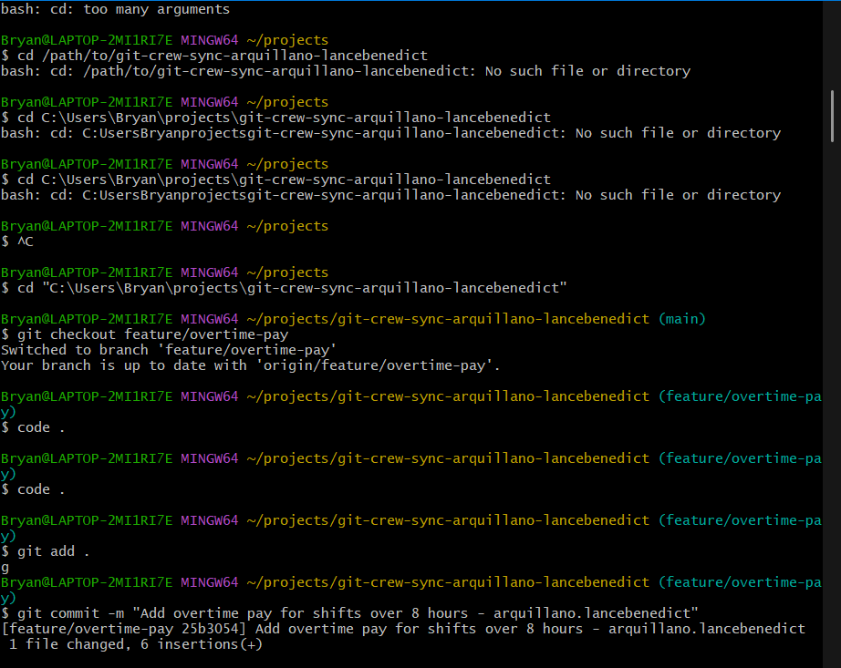
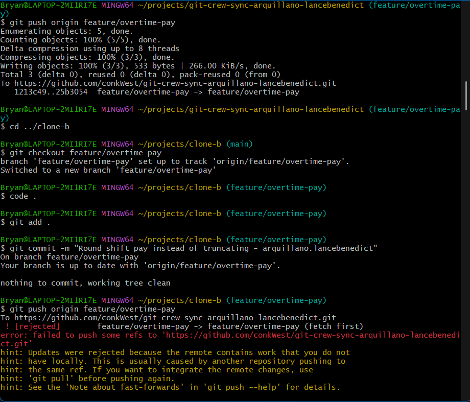
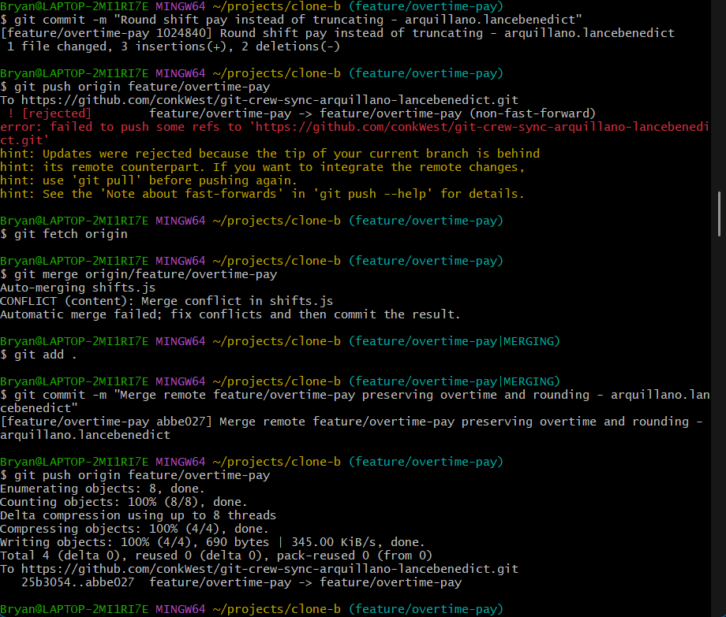
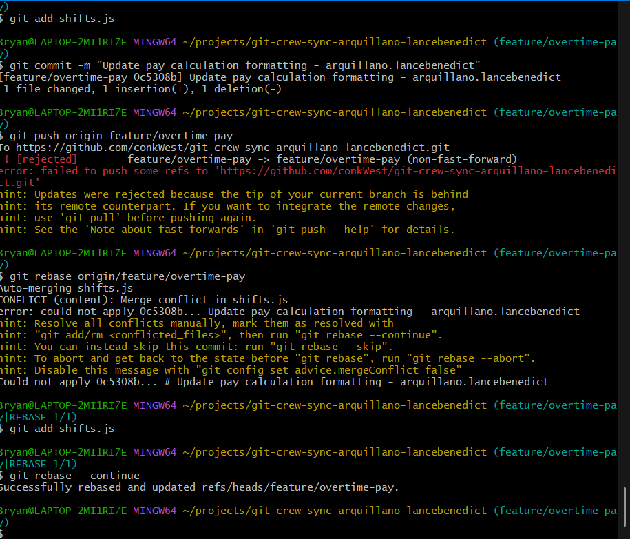
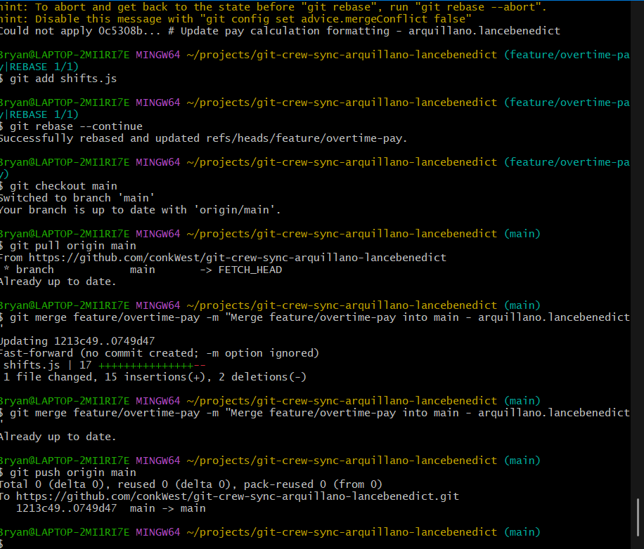
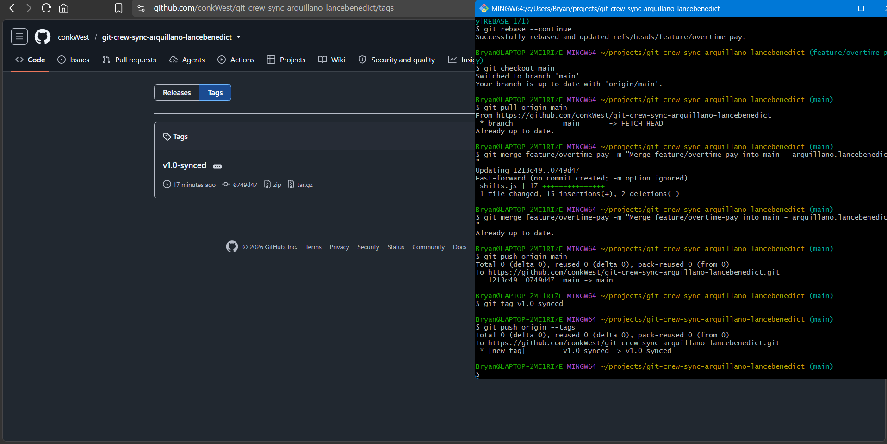

# Git Crew Sync Workflow Log
**Name:** Lance Benedict M. Arquillano  
**Subject Code & Section:** CSIT327 - G6
**Repository:** git-crew-sync-arquillano-lancebenedict  https://github.com/conkWest/git-crew-sync-arquillano-lancebenedict

---

## Task Evidence

### Task 1: Overtime Pay Push (Clone A)

### Task 2: Push Rejection (Clone B)

### Task 3: Merge Conflict Resolution & Push (Clone B)

### Task 4: Rebase Conflict Resolution & Push (Clone A)

### Task 5: Merge into Main

### Task 6: Tag v1.0-synced Release

---

## Technical Analysis

### 1. What did the rejected push error message tell you, and why did it happen?
The error message `! [rejected] (fetch first)` indicated a non-fast-forward update failure. It happened because Git rejects a push when the remote tracking branch contains commits that do not exist in the local branch history, which occurred because the first clone had already pushed a new commit to `origin/feature/overtime-pay`. When clone-b attempted to push its local commit from an older base commit, accepting it would have overwritten the first branch's commit on the remote server. Git protects against data loss by requiring the local repository to integrate remote changes before pushing.

### 2. What's the actual difference between how you resolved Task 3 (merge) vs Task 4 (rebase)?
`git merge` in Task 3 created a non-destructive 3-way merge commit that tied together the divergent branches of Clone A and Clone B, preserving the exact chronological sequence and branch topology and being a safer way to resolve issues in git repositories. 
Conversely, resolving task 4 with `git rebase` rewrote the local commit history. It lifted Clone A's new local commit, replayed it on top of the latest tip of `origin/feature/overtime-pay`, and avoided creating an extra merge commit, resulting in a linear, streamlined Git history.

### 3. What one habit would have avoided both rejected pushes in this lab?
Running `git pull` (or `git fetch` followed by reviewing changes) immediately before starting work and right before attempting to push. Synchronizing local tracking branches with the remote state prevents local commits from diverging from the central repository.

### 4. Which approach - merge or rebase - would you default to on a shared team branch, and why?
On a shared team branch, **`git merge`** is the standard and safest default. Rebasing rewrites commit hashes; if a rebased branch is force-pushed to a remote that other collaborators are actively working against, it corrupts their commit histories and causes synchronization issues. Merging is the safest option when it comes to working in a shared team branch, preventing further issues down the line due to a stray **S`git rebase`** command